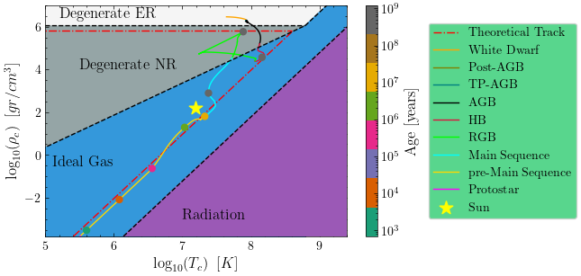
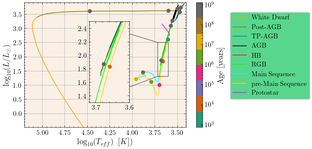
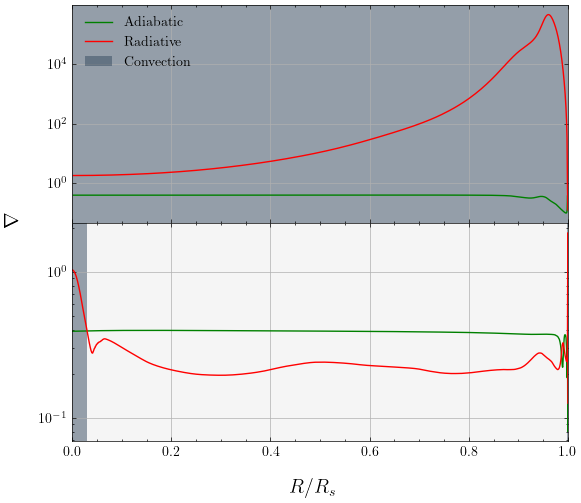

# Project on Stellar Evolution

The aim of this project is to study and compare the evolution of a $1 M_\odot$ star with a $2 M_\odot$ star of solar composition from a protostar to white dwarf. 

The project uses `MESA` which needs to be installed if you want to run the simulations. More information can be found [here](https://docs.mesastar.org/en/release-r23.05.1/). You can run it inside the `work` folder by following the instructions of the `README` file inside.

## Files
The project contains the following files:
- `visualization_1.ipynb`: notebook to create plots on the  $1 M_\odot$ star
- `visualization_2.ipynb`: notebook to create plots on the  $2 M_\odot$ star
- `my_plot.py`: useful definitions for the plots
- `report.pdf`: report explaining the simulations and visualization plots. Focuses on the evolution of the two stars

## Visualization Plots
The plots for the $2 M_\odot$ star

